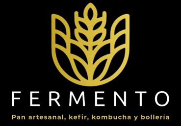

<p align="center">
  
</p>

<h1 align="center">Fermento — Sistema de ventas</h1>

<p align="center">
  Aplicación de escritorio para gestionar las ventas de una panadería.<br>
  Windows · Python + customtkinter + SQLite · sin servidor, sin internet, sin suscripción.
</p>

---

## Descargar

El programa se distribuye como un ZIP listo para usar. **No hace falta instalar Python ni nada más.**

**[⬇ Descargar la última versión](../../releases/latest)**

Instalación y uso están explicados paso a paso, sin tecnicismos, en el manual que viene adentro del ZIP (`Fermento - Manual de instalacion y uso.docx`).

En resumen:

1. Crear una carpeta `Fermento` dentro de la carpeta personal del usuario (escribir `%USERPROFILE%` en la barra del Explorador).
2. Descomprimir el ZIP ahí adentro.
3. Abrir `Programa\Fermento.exe`.

> **Actualizar** es borrar la carpeta `Programa` y descomprimir el ZIP nuevo. El paquete no contiene ninguna base de datos, así que una actualización no puede pisar el historial de ventas.

## Qué hace

| Sección | Para qué sirve |
|---|---|
| **Nueva venta** | El mostrador: catálogo con buscador, carrito y ticket en PDF. |
| **Productos** | Catálogo, precios, costo interno y margen. Alta de tandas al salir del horno. |
| **Inventario** | Control manual de insumos (harina, azúcar…) con aviso de stock bajo. |
| **Historial** | Todas las ventas, con anulación; y los cortes de caja, con exportación a CSV. |
| **Análisis** | Cuánto se vendió, cuánto se resignó rematando y cuánto quedó de margen. |
| **Ajustes** | Reglas de descuento por antigüedad, versión y carpeta de datos. |

### Lo que lo hace distinto de un punto de venta genérico

- **Tandas con descuento automático por antigüedad.** Cada hornada es un lote con su propia fecha. El pan de hoy y el de ayer conviven como líneas separadas del mismo producto, cada una con su precio, calculado al vender según reglas configurables (`a los 2 días, −25 %`). No hay que retocar precios a mano ni crear productos "de ayer".
- **Los números se congelan en la venta.** Precio, costo, precio de lista y antigüedad quedan guardados en cada línea. Cambiar el precio de un producto hoy no altera ni una venta ni un corte pasados.
- **"Sin datos" nunca se muestra como cero.** Si a un producto no se le cargó el costo, el margen aparece como `—`, no como 100 %.
- **El corte de caja es un hecho contable**, no una consulta agrupada: se congela al cerrarlo y no se mueve si después se corrige algo.

## Correr desde el código

```bash
pip install -r requirements.txt
python main.py
```

Otros comandos:

```bash
python -m unittest test_dinero    # 48 pruebas de las cuentas
python empaquetar.py              # arma el ZIP distribuible en dist/
python generar_manual.py          # regenera el manual (.docx)
```

## Datos

La aplicación guarda todo en una carpeta `Datos` hermana de la del programa: la base SQLite, los respaldos automáticos (uno por arranque, los últimos 30), los tickets en PDF y el registro de errores. **Esa carpeta nunca se toca al actualizar**, y no forma parte de este repositorio.

## Documentación

- **`DOCUMENTACION.md`** — instalación, empaquetado, validaciones e historial de cambios.
- **`CLAUDE.md`** — arquitectura y las decisiones de diseño que no se deducen leyendo el código.

## Estado

En producción en una panadería. Ver el historial de cambios en `DOCUMENTACION.md` y los pendientes conocidos al final de `CLAUDE.md`.
